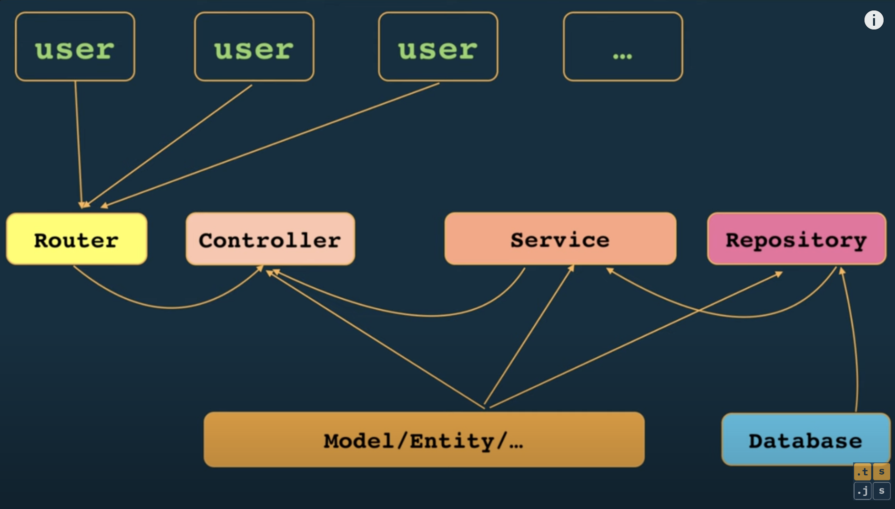

# ecom-golang
build ecommerce project using golang
## structure golang project
project/
|-- api/
|   |-- handle/         # API handle request API
|   |-- middleware/     # API middleware
|   |__ router.go       # router
|-- cmd/
|   |-- app/            # start app
|   |-- cli/            # command line
|-- config/             # anything relate to configuration
|-- internal/           # code using for specific project
|   |-- model/          # model dbs (define ORM)
|   |-- repository/     # access database
|   |-- service/        # logic bussiness
|   |-- util/           # util helpful
|-- migrations/         # migration database
|-- pkg/                # libary has been defined
|-- scripts/            # Buill, install, ...
|-- test/               # test
|-- web/                # FE code (if we have it)
|-- .gitignore          # Git gitignore
|-- LICENSE             # License project
|-- README.md           # Description project
|__ go.mod              # go init

## Diagram project
